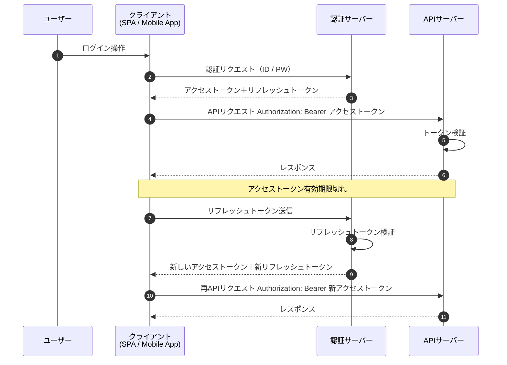

# Bearer認証の学習まとめ

## 概要

Bearer認証（Bearer Authentication）は、HTTP通信における認証方式の一つで、  
**トークンを所持しているクライアント（Bearer）を正当な利用者として認証する**  
という考え方に基づいている。  
主にREST APIやOAuth 2.0を利用したシステムで広く採用されている。

## 仕組み

Bearer認証では、以下の流れで認証が行われる。

1. クライアントが認証サーバーに対して認証を行う  
2. 認証が成功すると、サーバーからアクセストークンが発行される  
3. クライアントはAPIリクエスト時にトークンを送信する  
4. サーバーはトークンを検証し、有効であればリクエストを許可する  

トークンはHTTPヘッダーの `Authorization` に設定される。

```http
Authorization: Bearer <アクセストークン>
```

## 特徴

- アクセストークンを保持しているだけで認証が成立する  
- ID・パスワードを毎回送信する必要がない  
- トークンには有効期限が設定されることが多い  
- ステートレスな認証が可能で、サーバー側の負荷を軽減できる  

## 主な利用シーン

- OAuth 2.0を利用した認可・認証
- REST APIへのアクセス制御
- SPA（Single Page Application）とバックエンドAPIの連携
- 外部サービスが提供するAPIの利用

## メリット

- 認証情報を簡潔に扱えるため実装が容易
- APIとの親和性が高い
- サーバー側でセッション管理が不要な場合が多く、スケーラビリティに優れる

## 注意点

Bearer認証は「トークンを持っている利用者」を正当とみなすため、  
トークン漏洩時のリスクが高い点に注意が必要である。

- HTTPS通信の利用は必須
- XSS対策を考慮したトークンの保存方法が必要
- 有効期限の短いトークンやリフレッシュトークンの併用が望ましい
- トークン失効時の運用設計が重要

## まとめ

Bearer認証は、現代のWeb APIにおいて標準的に採用されている認証方式である。  
利便性や拡張性に優れる一方で、トークン管理を誤るとセキュリティリスクが高まる。  
そのため、通信の暗号化やトークンの寿命設計を含めた適切な運用が不可欠である。

---

<details> <summary>上記を踏まえた上での考察図（クリックで展開）</summary>


</details>