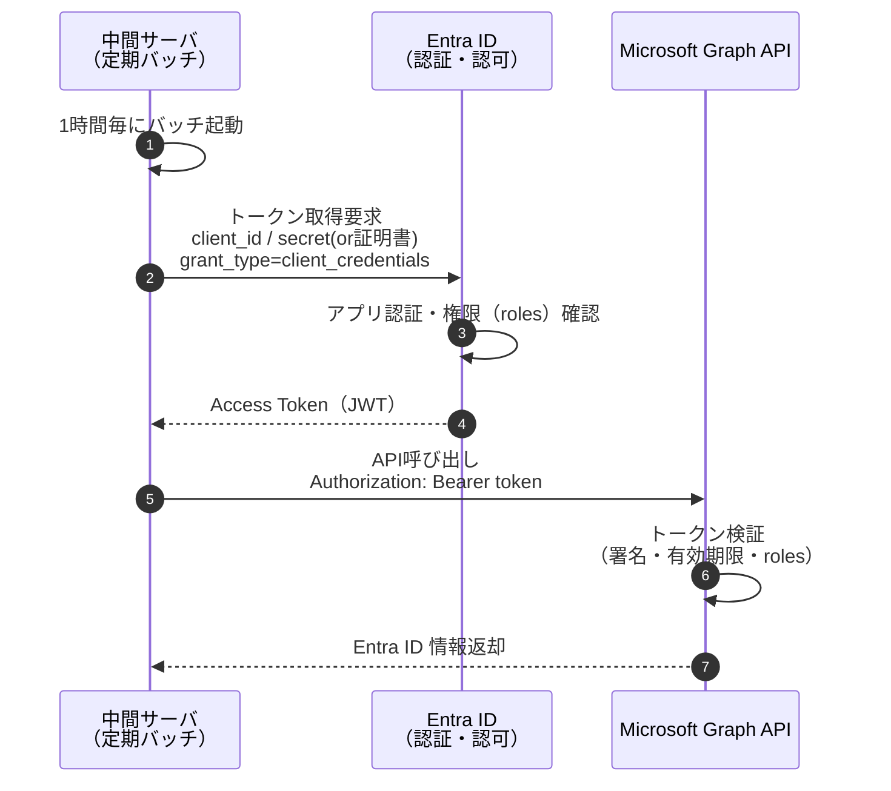

```mermaid
sequenceDiagram
    autonumber
    participant Batch as 中間サーバ<br/>（定期バッチ）
    participant Entra as Entra ID<br/>（認証・認可）
    participant Graph as Microsoft Graph API

    Batch->>Batch: 1時間毎にバッチ起動

    Batch->>Entra: トークン取得要求<br/>client_id / secret(or証明書)<br/>grant_type=client_credentials
    Entra->>Entra: アプリ認証・権限（roles）確認
    Entra-->>Batch: Access Token（JWT）

    Batch->>Graph: API呼び出し<br/>Authorization: Bearer token
    Graph->>Graph: トークン検証<br/>（署名・有効期限・roles）
    Graph-->>Batch: Entra ID 情報返却
```