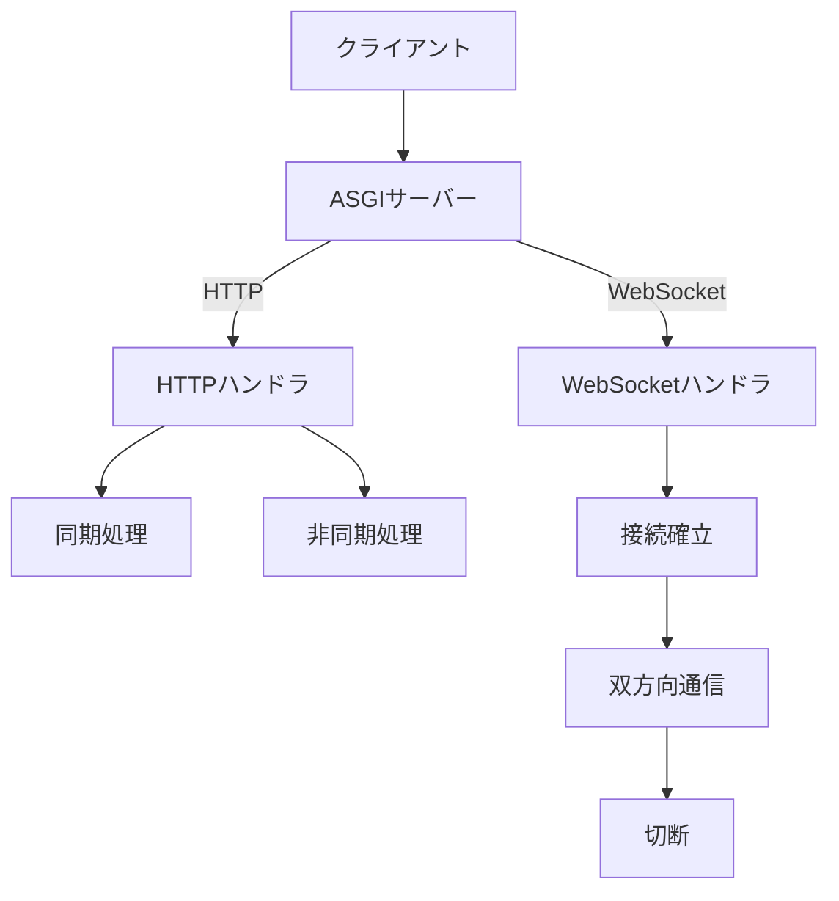

## ASGIサーバーとは

ASGIサーバーとは、PythonのWebアプリケーションを動かすためのサーバーで、  
**ASGI（Asynchronous Server Gateway Interface）** という規格に対応したものです。

---

## ASGIとは？

ASGIは、従来の **WSGI** を拡張した新しいインターフェース規格で、  
以下のような機能を扱えるようにしたものです。

- 非同期処理（`async / await`）
- WebSocket
- 長時間接続（リアルタイム通信）

---

## まとめ

**「非同期・リアルタイム通信に対応した  
Python Webアプリの共通ルール」**

ASGIサーバーの処理フロー（クリックで展開）

