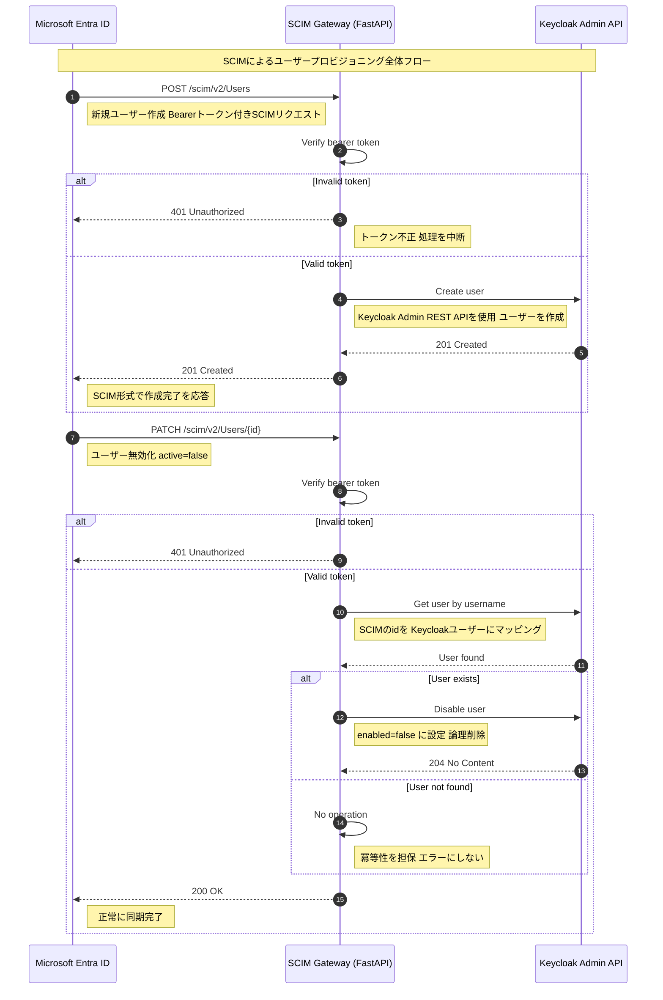

```mermaid
sequenceDiagram
    autonumber

    participant EntraID as Microsoft Entra ID
    participant Gateway as SCIM Gateway (FastAPI)
    participant Keycloak as Keycloak Admin API

    Note over EntraID,Keycloak: SCIMによるユーザープロビジョニング全体フロー

    EntraID->>Gateway: POST /scim/v2/Users
    Note right of EntraID: 新規ユーザー作成 Bearerトークン付きSCIMリクエスト
    Gateway->>Gateway: Verify bearer token

    alt Invalid token
        Gateway-->>EntraID: 401 Unauthorized
        Note right of Gateway: トークン不正 処理を中断
    else Valid token
        Gateway->>Keycloak: Create user
        Note right of Gateway: Keycloak Admin REST APIを使用 ユーザーを作成
        Keycloak-->>Gateway: 201 Created
        Gateway-->>EntraID: 201 Created
        Note right of EntraID: SCIM形式で作成完了を応答
    end

    EntraID->>Gateway: PATCH /scim/v2/Users/{id}
    Note right of EntraID: ユーザー無効化 active=false
    Gateway->>Gateway: Verify bearer token

    alt Invalid token
        Gateway-->>EntraID: 401 Unauthorized
    else Valid token
        Gateway->>Keycloak: Get user by username
        Note right of Gateway: SCIMのidを Keycloakユーザーにマッピング
        Keycloak-->>Gateway: User found

        alt User exists
            Gateway->>Keycloak: Disable user
            Note right of Gateway: enabled=false に設定 論理削除
            Keycloak-->>Gateway: 204 No Content
        else User not found
            Gateway->>Gateway: No operation
            Note right of Gateway: 冪等性を担保 エラーにしない
        end

        Gateway-->>EntraID: 200 OK
        Note right of EntraID: 正常に同期完了
    end
```