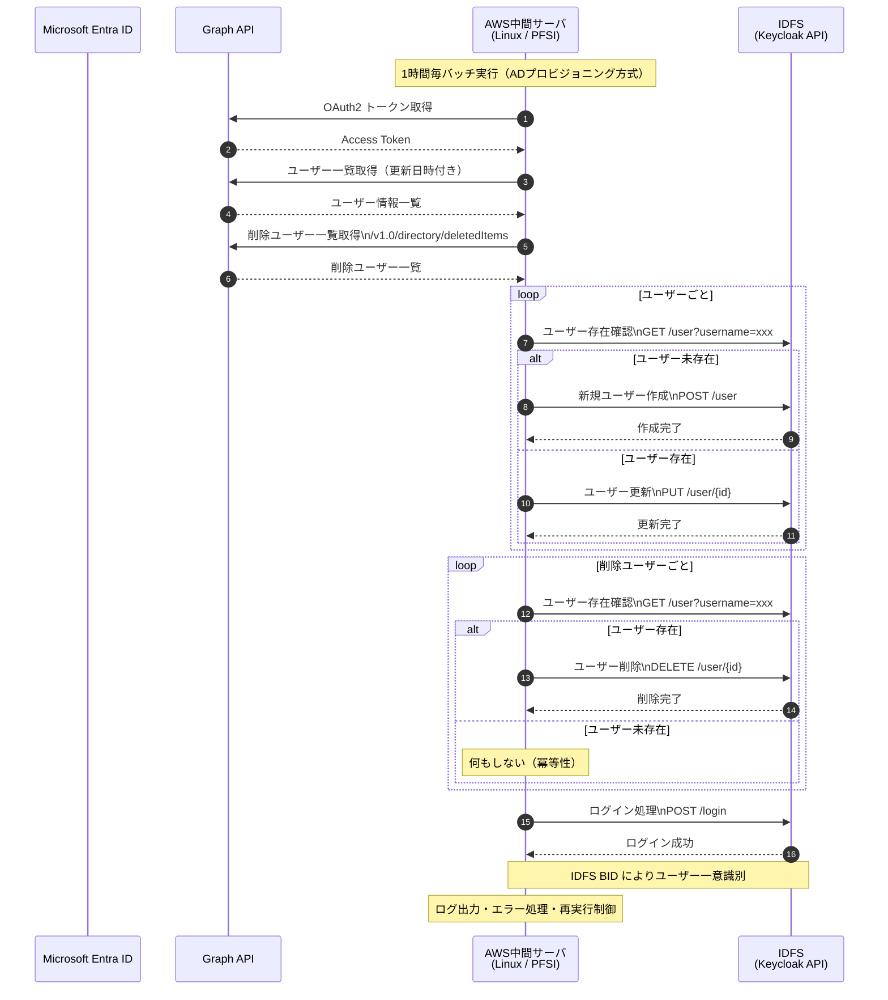

```mermaid
sequenceDiagram
    autonumber
    participant EntraID as Microsoft Entra ID
    participant GraphAPI as Graph API
    participant AWS as AWS中間サーバ<br/>(Linux / PFSI)
    participant IDFS as IDFS<br/>(Keycloak API)

    Note over AWS: 1時間毎バッチ実行（ADプロビジョニング方式）

    %% 認証
    AWS ->> GraphAPI: OAuth2 トークン取得
    GraphAPI -->> AWS: Access Token

    %% ユーザー取得
    AWS ->> GraphAPI: ユーザー一覧取得（更新日時付き）
    GraphAPI -->> AWS: ユーザー情報一覧

    %% 削除ユーザー取得
    AWS ->> GraphAPI: 削除ユーザー一覧取得\n/v1.0/directory/deletedItems
    GraphAPI -->> AWS: 削除ユーザー一覧

    %% 新規・更新ユーザー処理
    loop ユーザーごと
        AWS ->> IDFS: ユーザー存在確認\nGET /user?username=xxx
        alt ユーザー未存在
            AWS ->> IDFS: 新規ユーザー作成\nPOST /user
            IDFS -->> AWS: 作成完了
        else ユーザー存在
            AWS ->> IDFS: ユーザー更新\nPUT /user/{id}
            IDFS -->> AWS: 更新完了
        end
    end

    %% 削除ユーザー処理
    loop 削除ユーザーごと
        AWS ->> IDFS: ユーザー存在確認\nGET /user?username=xxx
        alt ユーザー存在
            AWS ->> IDFS: ユーザー削除\nDELETE /user/{id}
            IDFS -->> AWS: 削除完了
        else ユーザー未存在
            Note over AWS: 何もしない（冪等性）
        end
    end

    %% ログイン（必要時）
    AWS ->> IDFS: ログイン処理\nPOST /login
    IDFS -->> AWS: ログイン成功

    Note over AWS,IDFS: IDFS BID によりユーザー一意識別
    Note over AWS: ログ出力・エラー処理・再実行制御
```